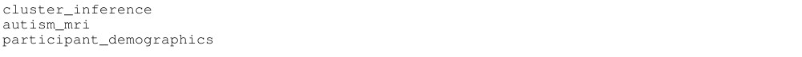
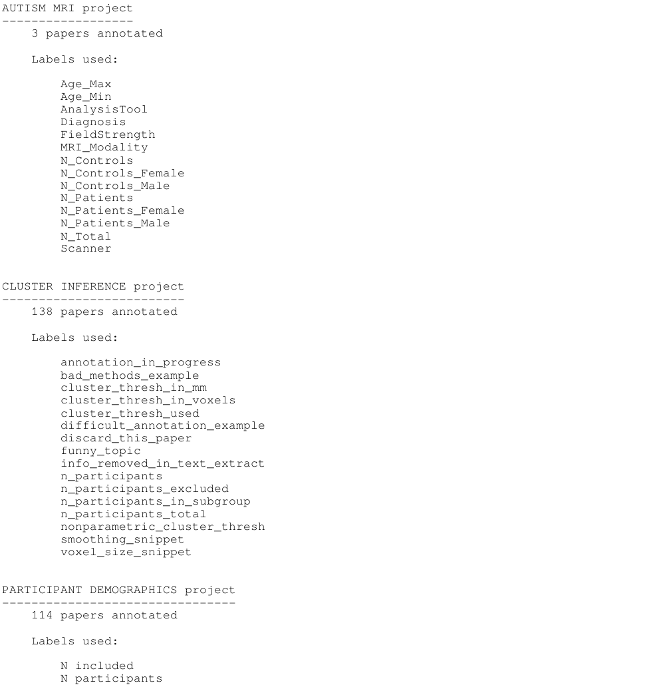

# labelbuddy-annotations
Annotations of academic papers. The papers were likely gathered using pubget, and the annotations made with labelbuddy.

# WIP

## View the data in this repo interactively
1) open our notebook by right-clicking on this Binder button and opening the link in a new tab ->  
   - The notebook will take a while to load because it needs to install the Python packages we need to run the interactive app (the installations are done on a virtual server, not your computer!)
2) When the notebook opens, click "run > run all cells" on the top toolbar

## Projects in this repo:

## Details for each project:

